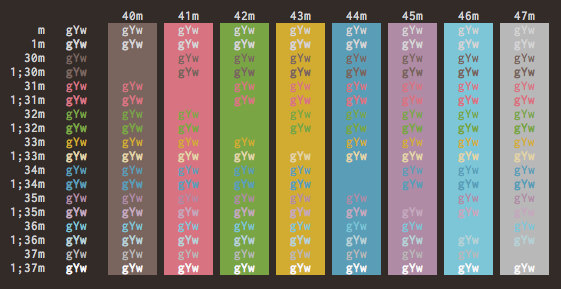

# iTerm2-gochiusa :rabbit:

| ファイル名 | 用途 |
| --- | --- |
| `colors.sh` | 見た目の確認 |
| `gochiusa.dircolors` | `ls` コマンドの出力に色をつけるための設定ファイル |
| `gochiusa.itermcolors` | iTerm2のカラースキーマ |

## `colors.sh`



https://github.com/mbadolato/iTerm2-Color-Schemes/blob/master/tools/screenshotTable.sh

## `gochiusa.dircolors`

```shell
# ~/.zshrc

eval $(dircolors path/to/gochiusa.dircolors)
if [ -n "$LS_COLORS" ]; then
    zstyle ':completion:*' list-colors ${(s.:.)LS_COLORS}
fi
```

## `gochiusa.itermcolors`

iTerm2.app > `Preferences` > `Profiles` > `Colors` > `Color Presets...` > `Import...`
